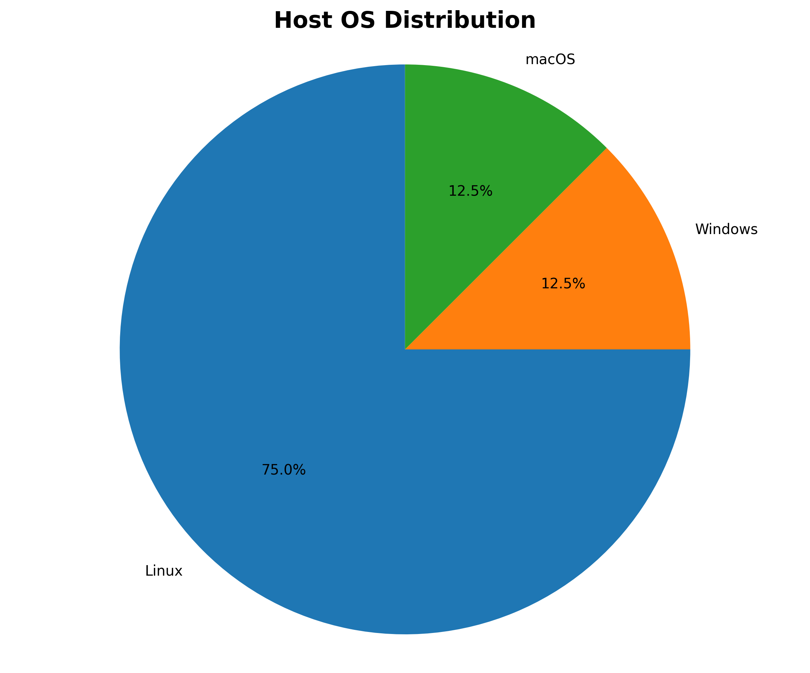
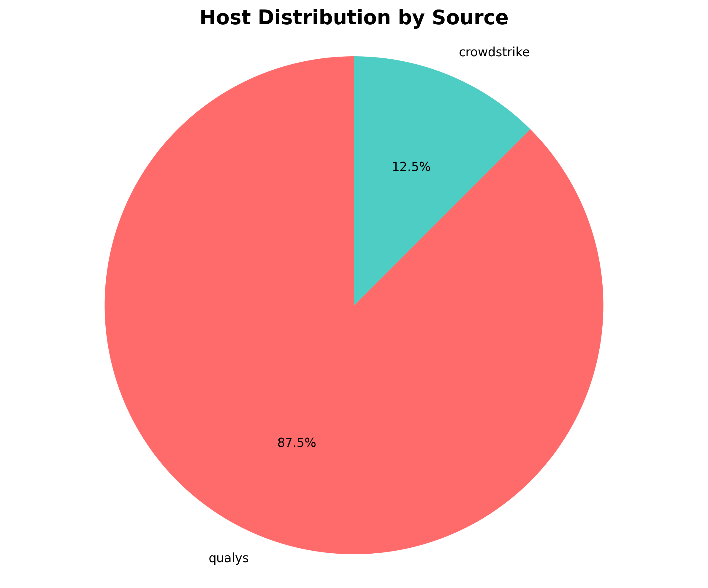
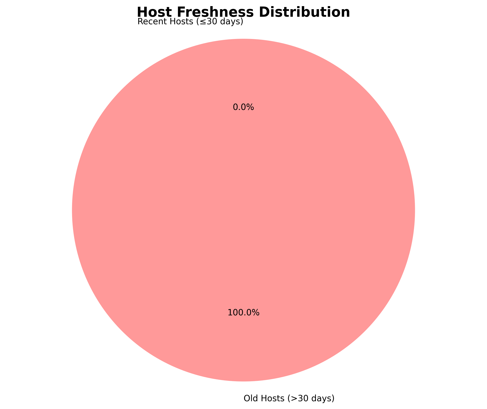

# 🧪 Host Data ETL Pipeline

A robust Python ETL pipeline that processes host data from Qualys and Crowdstrike APIs with hybrid pagination, deduplication, and MongoDB storage.

## 🚀 Quick Start

### Prerequisites
- Docker and Docker Compose installed
- API token for Silk Security API

### Installation

1. **Clone the repository:**
   ```bash
   git clone git@github.com:atamaniuc/hosts_etl.git
   cd armis
   ```

2. **Run the complete setup:**
   ```bash
   make install
   ```
   This will:
   - Request your API token (The system uses Silk API endpoints for both Qualys and Crowdstrike data.)
   You can find your API token in the [profile](https://recruiting.app.silk.security/profile) page.
   - Create `.env` file
   - Build Docker images
   - Start services
   - Run the ETL pipeline

## 🛠️ Available Commands

Run `make help` to see all available commands with descriptions.

### Build and Infrastructure
- `make build` - Build the Docker image
- `make up` - Start all services in background
- `make down` - Stop and remove all containers
- `make start` - Start existing containers
- `make stop` - Stop running containers

### Pipeline Execution
- `make install` - Complete setup and run pipeline
- `make run` - Run the ETL pipeline

### Testing and Quality
- `make test` - Run all unit tests
- `make coverage` - Run tests with coverage
- `make lint` - Run pylint checks
- `make format` - Format code with Black
- `make type-check` - Run mypy type checking
- `make check-all-linters` - Run all quality checks

### Monitoring
- `make logs` - View application logs
- `make shell` - Open shell in container

## 🚀 Hybrid Pagination Strategy

### Why This Approach

The API has specific limitations that required to implement a **hybrid pagination strategy**:

1. **API Limitations:**
   - Only supports `limit=1` and `limit=2` values
   - Returns error 500 for `limit=3` and above
   - With `limit=2`, the last host gets "skipped" due to pagination logic

2. **Performance vs Completeness Trade-off:**
   - `page_size=1`: Gets all hosts but requires 7 HTTP requests per source
   - `page_size=2`: Fast but misses the last host (only 6 hosts)
   - **Hybrid approach**: Best of both worlds

### How It Works

```python
# 1. Start with page_size=2 for optimal performance
params = {"skip": 0, "limit": 2}  # Gets hosts 1-2
params = {"skip": 2, "limit": 2}  # Gets hosts 3-4  
params = {"skip": 4, "limit": 2}  # Gets hosts 5-6

# 2. When API returns "invalid skip/limit combo" error
# 3. Make one final request with page_size=1
params = {"skip": 6, "limit": 1}  # Gets host 7
```

**Results:**
- ✅ **7 hosts per source** (complete data)
- ✅ **4 HTTP requests per source** (optimal performance)
- ✅ **Robust error handling** for API edge cases

### Performance Comparison

| Strategy | Requests per Source | Hosts Retrieved | Performance |
|----------|-------------------|-----------------|-------------|
| `page_size=1` | 7 | 7 | Slow |
| `page_size=2` | 3 | 6 | Fast but incomplete |
| **Hybrid** | **4** | **7** | **Optimal** ✅ |

## 🧱 Architecture Overview

```
                +------------------------+
                |    Qualys API (JSON)   |
                +-----------+------------+
                           |
                           v
                +------------------------+
                | Crowdstrike API (JSON) |
                +----------+-------------+
                           |
                           v
                      [ Extractors ]
                    (Hybrid Pagination)
                           |
                           v
                    [ Normalizers ]
                           |
                           v
                 [ Deduplication Logic ]
                           |
                           v
                +----------------------+
                |    MongoDB Storage   |
                +----------+-----------+
                           |
                           v
                  [ Visualizations ]
```

**Modules:**
- `fetchers/` – API data downloaders with hybrid pagination
- `processors/` – normalization + deduplication
- `storage/` – MongoDB upsert and indexing
- `visualizations/` – PNG charts for OS distribution and host freshness
- `main.py` – the orchestration entry point

## 📊 Pipeline Architecture

The pipeline implements a hybrid pagination strategy to handle API limitations:

### 🔄 Pipeline Steps

#### 1. **Extract** - Fetch data from APIs
- **Qualys API**: Fetches 7 hosts using hybrid pagination (4 requests)
- **Crowdstrike API**: Fetches 7 hosts using hybrid pagination (4 requests)
- **Total**: 14 hosts fetched from both sources

#### 2. **Transform** - Normalize and deduplicate data

**Normalization:**
- **Field mapping**: Converts different field names to standard format
  - `address` → `ip`
  - `dnsHostName` → `hostname`
  - `os` → `os`
- **Data cleaning**: Removes duplicates, handles missing values
- **Source tagging**: Adds `source: "qualys"` or `source: "crowdstrike"`

**Deduplication:**
- **Composite key**: Uses `(ip, hostname)` to identify unique hosts
- **Strategy**: Keeps the most recent data when duplicates found
- **Result**: 14 hosts → 8 unique hosts (6 duplicates removed)

#### 3. **Load** - Store to MongoDB
- **Upsert logic**: Updates existing hosts or inserts new ones
- **Indexing**: Creates indexes on `ip` and `hostname` for fast queries
- **Storage**: Saves normalized and deduplicated data

#### 4. **Visualize** - Generate charts and statistics
- **OS Distribution**: Linux (75%), Windows (12.5%), macOS (12.5%)
- **Source Distribution**: Qualys (87.5%), Crowdstrike (12.5%)
- **Host Freshness**: Old hosts (>30 days) vs recent hosts
- **Output**: PNG charts saved to `app/visualizations/images/`

## 🧪 Testing

Run the complete test suite:
```bash
make test
```

Run with coverage:
```bash
make coverage
```

## 📈 Monitoring

View real-time logs:
```bash
make logs
```

Access container shell:
```bash
make shell
```

## 🔍 Code Quality

The project maintains high code quality standards:

- **Pylint**: 10.00/10 score
- **Black**: Consistent code formatting
- **MyPy**: Type checking
- **Pytest**: Comprehensive test coverage

Run all quality checks:
```bash
make check-all-linters
```

## 🚀 Scalability Plan

This system is designed to scale horizontally and handle millions of host records across multiple providers.

### 1. **Extract Phase**
✅ Implemented:
- **Hybrid pagination strategy** for optimal performance
- Token-based auth
- Robust error handling for API edge cases

🟡 To scale:
- Async fetching (`httpx.AsyncClient`)
- Message queues for decoupling (`Kafka`, `RabbitMQ`)
- Rate-limiting and retry logic

### 2. **Transform Phase**
✅ Implemented:
- Field-based normalization
- Deduplication logic using composite key (`ip`, `hostname`)

🟡 To scale:
- Batch processing
- Parallel normalization with thread pools
- MongoDB aggregation-based deduplication

### 3. **Load Phase**
✅ Implemented:
- `upsert` logic for safe merges
- Indexes on key fields for fast querying

🟡 To scale:
- MongoDB sharded cluster
- Buffered or streaming insert layer

### 4. **Visualization**
✅ Implemented:
- Static charts (matplotlib)

🟡 To scale:
- Pre-aggregated stats storage
- Scheduled chart generation
- Dashboard integration (e.g. Grafana/Metabase)

## ✅ Completed Features

- [x] Fetch and normalize Qualys data
- [x] Fetch and normalize Crowdstrike data
- [x] **Implement hybrid pagination strategy**
- [x] Deduplicate and merge records
- [x] Store to MongoDB with upserts
- [x] Create indexes for key fields
- [x] Generate visualizations (OS & freshness)
- [x] Unit tests with `pytest`
- [x] Dockerized pipeline
- [x] Add logging and error handling
- [x] Code quality tools (pylint, black, mypy)
- [x] Comprehensive Makefile with help
- [x] API token management

## 📎 Tech Stack

- **Python 3.10**
- **MongoDB**
- `requests`, `pymongo`, `matplotlib`, `python-dotenv`
- `pytest` for testing
- Docker + Docker Compose
- `make` for automation

## 📈 Visualizations

The pipeline generates static visualizations from the deduplicated data.

### Generated Charts



**OS Distribution**: Shows the distribution of operating systems across all hosts (Linux, Windows, macOS)



**Source Distribution**: Shows the distribution of hosts by data source (Qualys vs Crowdstrike)



**Host Freshness**: Shows the ratio of old hosts (>30 days) vs recent hosts (≤30 days)

The charts are automatically created in the `app/visualizations/images/` directory when the pipeline runs. 

[](https://github.com/atamaniuc/hosts_etl/actions/workflows/ci.yml)
